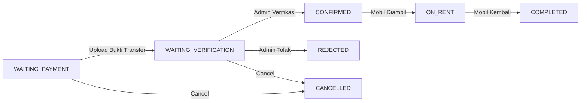

# SISTEM INFORMASI RENTAL MOBIL BERBASIS WEB
# (Studi Kasus: Agil Rental Mobil Ambon)

## SKRIPSI

Diajukan sebagai salah satu syarat untuk memperoleh gelar Sarjana Komputer (S.Kom)

### Disusun oleh:
**Nama Mahasiswa**
**NIM: 1234567890**

---

### PROGRAM STUDI TEKNIK INFORMATIKA
### FAKULTAS ILMU KOMPUTER
### UNIVERSITAS X
### 2026

---

# LEMBAR PENGESAHAN

Skripsi dengan judul **"Sistem Informasi Rental Mobil Berbasis Web (Studi Kasus: Agil Rental Mobil Ambon)"** telah disetujui dan disahkan pada:

- **Hari/Tanggal**: _________________
- **Tempat**: _________________

| Jabatan | Nama | Tanda Tangan |
|---------|------|-------------|
| Pembimbing 1 | _________________ | _____________ |
| Pembimbing 2 | _________________ | _____________ |
| Penguji 1 | _________________ | _____________ |
| Penguji 2 | _________________ | _____________ |

Mengetahui,
Ketua Program Studi Teknik Informatika

____________________________

---

# ABSTRAK

Perkembangan teknologi informasi telah mengubah cara bisnis beroperasi, termasuk di bidang rental mobil. Agil Rental Mobil yang berlokasi di Jl. Dr. Malaihollo, Benteng, Ambon, masih menggunakan sistem manual dalam mengelola pemesanan dan administrasi rental mobil. Sistem manual ini menimbulkan berbagai kendala seperti pencatatan yang tidak terstruktur, sulitnya melacak status pemesanan, lambatnya proses verifikasi pembayaran, dan minimnya informasi yang dapat diakses pelanggan.

Penelitian ini bertujuan untuk membangun sebuah sistem informasi rental mobil berbasis web yang dapat mempermudah proses pemesanan dan pengelolaan rental mobil di Agil Rental Mobil Ambon. Sistem dibangun menggunakan teknologi Next.js sebagai framework frontend dan backend, Prisma ORM untuk pengelolaan database PostgreSQL, serta Tailwind CSS untuk antarmuka pengguna yang responsif. Sistem ini memiliki dua role utama: Customer dan Admin, dengan fitur-fitur seperti pengelolaan armada mobil, pemesanan multi-langkah, upload dokumen KTP dan bukti transfer, verifikasi pembayaran, dashboard statistik, dan laporan transaksi.

Hasil dari penelitian ini adalah sebuah aplikasi web yang telah di-deploy dan dapat diakses secara publik di https://rent-car-flame.vercel.app. Pengujian sistem dilakukan menggunakan metode blackbox testing pada seluruh fitur API dan antarmuka pengguna, dengan hasil seluruh fitur berjalan sesuai spesifikasi yang diharapkan.

**Kata Kunci**: Sistem Informasi, Rental Mobil, Web, Next.js, PostgreSQL, Prisma, Ambon

---

# KATA PENGANTAR

Puji syukur penulis panjatkan kepada Tuhan Yang Maha Esa karena atas berkat dan rahmat-Nya, penulis dapat menyelesaikan skripsi yang berjudul **"Sistem Informasi Rental Mobil Berbasis Web (Studi Kasus: Agil Rental Mobil Ambon)"** dengan baik dan tepat waktu.

Skripsi ini disusun sebagai salah satu syarat untuk memperoleh gelar Sarjana Komputer pada Program Studi Teknik Informatika, Fakultas Ilmu Komputer.

Penulis menyadari bahwa dalam penyusunan skripsi ini tidak lepas dari bantuan, bimbingan, dan dukungan dari berbagai pihak. Oleh karena itu, pada kesempatan ini penulis ingin menyampaikan terima kasih kepada:

1. Bapak/Ibu Rektor Universitas X
2. Bapak/Ibu Dekan Fakultas Ilmu Komputer
3. Bapak/Ibu Ketua Program Studi Teknik Informatika
4. Bapak/Ibu Dosen Pembimbing yang telah memberikan arahan dan masukan
5. Pemilik Agil Rental Mobil yang telah memberikan izin penelitian
6. Keluarga tercinta yang selalu memberikan doa dan dukungan
7. Teman-teman seperjuangan yang telah membantu dan memotivasi

Penulis menyadari bahwa skripsi ini masih jauh dari sempurna. Oleh karena itu, kritik dan saran yang membangun sangat penulis harapkan. Semoga skripsi ini dapat bermanfaat bagi pembaca dan pengembangan ilmu pengetahuan.

Ambon, Juni 2026

Penulis

---

# DAFTAR ISI

1. [BAB I — PENDAHULUAN](#bab-i--pendahuluan)
   - 1.1 Latar Belakang
   - 1.2 Rumusan Masalah
   - 1.3 Batasan Masalah
   - 1.4 Tujuan Penelitian
   - 1.5 Manfaat Penelitian
   - 1.6 Sistematika Penulisan

2. [BAB II — TINJAUAN PUSTAKA & LANDASAN TEORI](#bab-ii--tinjauan-pustaka--landasan-teori)
   - 2.1 Penelitian Terdahulu
   - 2.2 Landasan Teori
   - 2.3 Tools & Teknologi

3. [BAB III — METODOLOGI PENELITIAN](#bab-iii--metodologi-penelitian)
   - 3.1 Metode Pengembangan Sistem
   - 3.2 Metode Pengumpulan Data
   - 3.3 Analisis Kebutuhan

4. [BAB IV — ANALISIS & PERANCANGAN SISTEM](#bab-iv--analisis--perancangan-sistem)
   - 4.1 Analisis Sistem Berjalan
   - 4.2 Analisis Sistem Usulan
   - 4.3 Perancangan Database
   - 4.4 Perancangan Antarmuka

5. [BAB V — IMPLEMENTASI & PENGUJIAN](#bab-v--implementasi--pengujian)
   - 5.1 Lingkungan Implementasi
   - 5.2 Implementasi Database
   - 5.3 Implementasi API
   - 5.4 Implementasi Antarmuka
   - 5.5 Pengujian Sistem

6. [BAB VI — PENUTUP](#bab-vi--penutup)
   - 6.1 Kesimpulan
   - 6.2 Saran

---

# BAB I — PENDAHULUAN

## 1.1 Latar Belakang

Kota Ambon sebagai ibu kota Provinsi Maluku memiliki aktivitas ekonomi dan pariwisata yang terus berkembang. Kebutuhan akan transportasi yang fleksibel, terutama rental mobil, semakin meningkat seiring dengan pertumbuhan kunjungan wisatawan dan aktivitas bisnis di kota ini. Agil Rental Mobil yang berlokasi di Jl. Dr. Malaihollo, Benteng, Ambon, merupakan salah satu penyedia jasa rental mobil yang melayani berbagai kebutuhan seperti sewa lepas kunci, rental dengan supir, antar jemput unit, perjalanan dinas, dan tour kota.

Namun demikian, Agil Rental Mobil masih menghadapi beberapa kendala dalam operasionalnya. Proses pemesanan masih dilakukan secara manual melalui telepon atau WhatsApp, pencatatan data pemesanan menggunakan buku atau spreadsheet sederhana, dan pelanggan harus datang langsung atau menghubungi admin untuk mengetahui ketersediaan mobil. Hal ini menyebabkan:

1. **Keterbatasan Akses Informasi**: Pelanggan tidak dapat melihat ketersediaan mobil, harga, dan spesifikasi secara real-time.
2. **Proses Pemesanan Lambat**: Verifikasi pembayaran dan konfirmasi pemesanan memakan waktu karena dilakukan manual.
3. **Pencatatan Tidak Terstruktur**: Data pemesanan, pembayaran, dan riwayat pelanggan tidak tersimpan dalam database terpusat.
4. **Kesulitan Pembuatan Laporan**: Admin kesulitan membuat laporan transaksi dan pendapatan secara akurat dan cepat.

Berdasarkan permasalahan tersebut, diperlukan sebuah sistem informasi rental mobil berbasis web yang dapat mengintegrasikan seluruh proses bisnis Agil Rental Mobil. Sistem ini akan memungkinkan pelanggan untuk melihat katalog mobil secara online, melakukan pemesanan, mengupload dokumen, dan melacak status pemesanan. Di sisi admin, sistem akan mempermudah pengelolaan armada mobil, verifikasi pembayaran, dan pembuatan laporan.

## 1.2 Rumusan Masalah

Berdasarkan latar belakang di atas, dapat dirumuskan permasalahan sebagai berikut:

1. Bagaimana merancang sistem informasi rental mobil berbasis web yang sesuai dengan kebutuhan Agil Rental Mobil Ambon?
2. Bagaimana mengimplementasikan sistem yang memungkinkan pelanggan melakukan pemesanan mobil secara online dengan proses yang terstruktur?
3. Bagaimana mengimplementasikan dashboard admin untuk pengelolaan armada, verifikasi pembayaran, dan pembuatan laporan?
4. Bagaimana hasil pengujian sistem terhadap fungsionalitas dan kemudahan penggunaan?

## 1.3 Batasan Masalah

Agar penelitian lebih terfokus, diberikan batasan-batasan sebagai berikut:

1. Sistem dibangun berbasis web menggunakan framework Next.js dengan database PostgreSQL.
2. Meliputi framework Next.js dengan database PostgreSQL.
3. Fitur meliputi: manajemen data mobil, pemesanan dengan upload dokumen, verifikasi pembayaran, dashboard admin, laporan transaksi, dan pengaturan rental.
4. Sistem memiliki dua role: Customer (pelanggan) dan Admin (pengelola).
5. Pembayaran dilakukan secara manual (transfer bank) — sistem tidak terintegrasi dengan payment gateway.
6. Penelitian dilakukan di Agil Rental Mobil Jl. Dr. Malaihollo, Benteng, Ambon.

## 1.4 Tujuan Penelitian

Tujuan dari penelitian ini adalah:

1. Merancang dan membangun sistem informasi rental mobil berbasis web untuk Agil Rental Mobil Ambon.
2. Mengimplementasikan sistem yang memudahkan pelanggan dalam melihat katalog, memesan mobil, dan melacak status pemesanan.
3. Menyediakan dashboard admin untuk pengelolaan armada, verifikasi pembayaran, dan laporan.
4. Menguji fungsionalitas sistem secara menyeluruh untuk memastikan semua fitur berjalan dengan baik.

## 1.5 Manfaat Penelitian

Penelitian ini diharapkan memberikan manfaat:

**Bagi Agil Rental Mobil:**
- Mempermudah pengelolaan data mobil, pemesanan, dan pembayaran
- Mempercepat proses verifikasi dan konfirmasi pemesanan
- Memudahkan pembuatan laporan transaksi dan pendapatan
- Meningkatkan profesionalitas layanan dengan sistem online

**Bagi Pelanggan:**
- Dapat melihat katalog mobil dan harga secara online 24/7
- Dapat melakukan pemesanan kapan saja tanpa harus menghubungi admin
- Dapat melacak status pemesanan secara real-time
- Mendapatkan informasi pembayaran yang jelas

**Bagi Peneliti:**
- Menerapkan ilmu yang telah dipelajari selama masa perkuliahan
- Menambah pengalaman dalam membangun aplikasi web skala produksi
- Memberikan kontribusi nyata bagi UMKM lokal

## 1.6 Sistematika Penulisan

Sistematika penulisan skripsi ini terdiri dari enam bab:

**BAB I — PENDAHULUAN**: Berisi latar belakang, rumusan masalah, batasan masalah, tujuan penelitian, manfaat penelitian, dan sistematika penulisan.

**BAB II — TINJAUAN PUSTAKA & LANDASAN TEORI**: Berisi penelitian terdahulu, landasan teori tentang sistem informasi, rental mobil, teknologi yang digunakan (Next.js, Prisma, PostgreSQL, Tailwind CSS).

**BAB III — METODOLOGI PENELITIAN**: Berisi metode pengembangan sistem (Waterfall/RAD), metode pengumpulan data, dan analisis kebutuhan sistem.

**BAB IV — ANALISIS & PERANCANGAN SISTEM**: Berisi analisis sistem berjalan, analisis sistem usulan, perancangan database (ERD, skema), dan perancangan antarmuka (mockup).

**BAB V — IMPLEMENTASI & PENGUJIAN**: Berisi implementasi database, API, antarmuka, dan hasil pengujian blackbox.

**BAB VI — PENUTUP**: Berisi kesimpulan dan saran untuk pengembangan lebih lanjut.

---

# BAB II — TINJAUAN PUSTAKA & LANDASAN TEORI

## 2.1 Penelitian Terdahulu

Beberapa penelitian yang relevan dengan topik ini antara lain:

1. **Sistem Informasi Rental Mobil Berbasis Web** oleh Pratama (2021) — Membangun sistem rental menggunakan PHP dan MySQL dengan fitur pemesanan dan pengelolaan armada. Kelemahan: antarmuka kurang responsif, tidak ada fitur upload dokumen.

2. **Aplikasi Rental Mobil Online Menggunakan Framework Laravel** oleh Wijaya (2022) — Mengimplementasikan sistem rental dengan payment gateway Midtrans. Keunggulan: integrasi pembayaran online.

3. **Rancang Bangun Aplikasi Penyewaan Mobil Berbasis Web Responsive** oleh Sari (2023) — Fokus pada responsive design menggunakan Bootstrap. Kelemahan: tidak ada dashboard admin yang komprehensif.

Penelitian ini mengembangkan sistem dengan keunggulan:
- Full-stack JavaScript dengan Next.js untuk performa lebih baik
- Fitur upload KTP dan bukti transfer yang terintegrasi
- Dashboard admin lengkap dengan statistik dan grafik pendapatan
- Laporan transaksi yang dapat difilter dan dicetak
- Antarmuka responsif mobile-friendly

## 2.2 Landasan Teori

### 2.2.1 Sistem Informasi

Sistem informasi adalah suatu sistem dalam suatu organisasi yang mempertemukan kebutuhan pengolahan transaksi harian, mendukung operasi, bersifat manajerial, dan kegiatan strategi dari suatu organisasi dan menyediakan pihak luar tertentu dengan laporan-laporan yang diperlukan (Jogiyanto, 2005).

### 2.2.2 Rental Mobil

Rental mobil adalah penyedia jasa penyewaan kendaraan roda empat dalam jangka waktu tertentu dengan tarif yang telah disepakati. Dalam bisnis rental mobil, terdapat beberapa komponen utama:
- **Armada**: Daftar mobil yang tersedia untuk disewakan
- **Pemesanan**: Proses customer memesan mobil untuk periode tertentu
- **Pembayaran**: Transfer biaya sewa beserta biaya tambahan
- **Dokumen**: KTP dan bukti transfer sebagai syarat sewa

### 2.2.3 Aplikasi Berbasis Web

Aplikasi berbasis web adalah aplikasi yang menggunakan teknologi browser untuk menjalankan aplikasi dan diakses melalui jaringan internet. Keunggulan aplikasi web:
- Dapat diakses dari berbagai perangkat (desktop, tablet, mobile)
- Tidak memerlukan instalasi di sisi client
- Pembaruan aplikasi langsung tersedia untuk semua pengguna
- Data tersimpan terpusat di server

## 2.3 Tools & Teknologi

### 2.3.1 Next.js

Next.js adalah framework React untuk membangun aplikasi web modern. Pada versi 16 yang digunakan dalam proyek ini, Next.js menggunakan App Router yang menyediakan fitur:
- **Server Components**: Rendering komponen di server untuk performa lebih baik
- **Server Actions**: Menangani form submission tanpa API endpoint terpisah
- **API Routes**: Endpoint REST API di dalam direktori `app/api/`
- **Static & Dynamic Rendering**: Optimasi halaman sesuai kebutuhan
- **Middleware**: Proteksi rute dan validasi request

### 2.3.2 Prisma ORM

Prisma adalah Object-Relational Mapping (ORM) untuk Node.js dan TypeScript. Prisma menyediakan:
- **Schema Definition**: Definisi model database dalam file `.prisma`
- **Migration**: Perubahan skema database yang terkelola
- **Type-Safe Client**: Query database dengan TypeScript type checking
- **Seed**: Pengisian data awal database

### 2.3.3 PostgreSQL

PostgreSQL adalah sistem manajemen basis data relasional open-source yang powerful. Keunggulannya:
- Mendukung tipe data kompleks (JSON, Array, Enum)
- ACID compliance untuk transaksi yang aman
- Performa tinggi untuk aplikasi skala menengah hingga besar
- Dukungan untuk fitur modern seperti full-text search

### 2.3.4 Tailwind CSS

Tailwind CSS adalah framework CSS utility-first untuk styling tanpa menulis CSS kustom. Keunggulan:
- Pengembangan UI yang cepat dengan class utility
- Responsive design built-in (sm:, md:, lg:, xl:)
- Dark mode dan tema kustom
- Optimasi bundle size dengan purging unused CSS

### 2.3.5 Teknologi Pendukung Lainnya

| Teknologi | Versi | Kegunaan |
|-----------|-------|----------|
| React | 19.2 | Library UI untuk komponen interaktif |
| TypeScript | 5.x | Type safety untuk pengembangan |
| jsonwebtoken | 9.0 | Autentikasi berbasis JWT |
| bcryptjs | 3.0 | Hashing password untuk keamanan |
| zod | 4.4 | Validasi form dan API input |
| react-hook-form | 7.76 | Manajemen form state |
| uuid | 14.0 | Generate unique ID |
| clsx + tailwind-merge | - | Utility class merging |

---

# BAB III — METODOLOGI PENELITIAN

## 3.1 Metode Pengembangan Sistem

Penelitian ini menggunakan metode **Rapid Application Development (RAD)** yang terdiri dari tiga fase:

### Fase 1: Requirements Planning (Perencanaan Kebutuhan)

Pada fase ini dilakukan:
1. **Observasi**: Mengamati proses bisnis Agil Rental Mobil secara langsung
2. **Wawancara**: Wawancara dengan pemilik (Gilbert Sipahelut) dan admin (Priscil) untuk memahami kebutuhan sistem
3. **Analisis Dokumen**: Mempelajari catatan pemesanan dan data armada yang ada

### Fase 2: User Design (Perancangan)

Pada fase ini dilakukan:
1. Perancangan database (Entity Relationship Diagram dan skema Prisma)
2. Perancangan antarmuka (wireframe untuk setiap halaman)
3. Perancangan API endpoints
4. Feedback dari pengguna pada prototype awal

### Fase 3: Construction (Implementasi)

Pada fase ini dilakukan:
1. Setup project Next.js dengan TypeScript
2. Implementasi database schema dengan Prisma
3. Implementasi API routes
4. Implementasi antarmuka pengguna
5. Integrasi upload file dan autentikasi
6. Deployment ke Vercel
7. Pengujian blackbox

## 3.2 Metode Pengumpulan Data

Data dikumpulkan melalui:

1. **Observasi**: Pengamatan langsung proses rental di lokasi Agil Rental Mobil
2. **Wawancara**: Tanya jawab dengan pemilik dan admin
3. **Studi Pustaka**: Mempelajari literatur tentang sistem informasi rental mobil

Data yang dikumpulkan meliputi:
- Daftar armada mobil (6 unit)
- Harga sewa untuk setiap mobil
- Prosedur pemesanan yang berjalan
- Informasi kontak dan jam operasional
- Data pelanggan yang ada

## 3.3 Analisis Kebutuhan

### 3.3.1 Kebutuhan Fungsional

**Role: Customer (Pelanggan)**
| ID | Fitur | Deskripsi |
|----|-------|-----------|
| F-01 | Registrasi Akun | Customer dapat mendaftar akun baru |
| F-02 | Login | Customer dapat login ke sistem |
| F-03 | Lihat Katalog Mobil | Melihat daftar mobil dengan filter |
| F-04 | Detail Mobil | Melihat informasi lengkap mobil |
| F-05 | Pemesanan | Melakukan booking 4 langkah |
| F-06 | Upload KTP | Upload foto KTP sebagai syarat sewa |
| F-07 | Upload Bukti Transfer | Upload bukti pembayaran |
| F-08 | Dashboard Customer | Melihat riwayat dan status pemesanan |

**Role: Admin (Pengelola)**
| ID | Fitur | Deskripsi |
|----|-------|-----------|
| F-09 | Dashboard Admin | Statistik ringkasan dan grafik |
| F-10 | Kelola Mobil | CRUD data armada dengan upload gambar |
| F-11 | Verifikasi Pesanan | Konfirmasi/tolak pemesanan |
| F-12 | Verifikasi Pembayaran | Konfirmasi/tolak bukti transfer |
| F-13 | Data Pelanggan | Melihat daftar dan riwayat pelanggan |
| F-14 | Laporan Transaksi | Laporan dengan filter dan cetak |
| F-15 | Pengaturan | Ubah info rental, jam operasional, logo |

### 3.3.2 Kebutuhan Non-Fungsional

| ID | Jenis | Spesifikasi |
|----|------|-------------|
| N-01 | Responsive | Bekerja di mobile, tablet, desktop |
| N-02 | Keamanan | Password di-hash, JWT untuk autentikasi |
| N-03 | Performa | Loading halaman < 3 detik |
| N-04 | Validasi | Form divalidasi client & server side |
| N-05 | Kompatibilitas | Browser modern (Chrome, Firefox, Safari) |

---

# BAB IV — ANALISIS & PERANCANGAN SISTEM

## 4.1 Analisis Sistem Berjalan

Sistem yang saat ini berjalan di Agil Rental Mobil digambarkan sebagai berikut:

```
[Pelanggan] → Telepon/WA Admin → Cek Ketersediaan
                                    ↓
[Admin] → Catat di Buku/Spreadsheet → Konfirmasi ke Pelanggan
                                           ↓
[Pelanggan] → Transfer Bank → WA Bukti Transfer
                                    ↓
[Admin] → Verifikasi Manual → Mobil Diserahkan
```

Kendala sistem berjalan:
1. Pelanggan harus menghubungi admin untuk cek ketersediaan
2. Pencatatan manual rawan kesalahan dan kehilangan data
3. Tidak ada riwayat pemesanan yang terstruktur
4. Laporan harus dihitung manual dari catatan
5. Pelanggan tidak bisa melihat status pemesanan secara mandiri

## 4.2 Analisis Sistem Usulan

Sistem usulan menerapkan otomatisasi penuh proses rental:

```
[Pelanggan] → Website → Login → Lihat Katalog
                                ↓
                        Pilih Mobil & Tanggal
                                ↓
                        Isi Form Pemesanan (4 langkah)
                                ↓
                        Upload KTP & Bukti Transfer
                                ↓
[Admin] → Dashboard → Verifikasi Pembayaran → Konfirmasi
                                ↓
[Pelanggan] ← Status Update (real-time di Dashboard)
                                ↓
                        Pengambilan Mobil
```

## 4.3 Perancangan Database

### 4.3.1 Entity Relationship Diagram (ERD)

```
┌──────────┐       ┌──────────┐       ┌───────────┐
│   User   │       │   Car    │       │  Booking  │
├──────────┤       ├──────────┤       ├───────────┤
│ id       │──┐    │ id       │──┐    │ id        │
│ name     │  │    │ name     │  │    │ bookingCode│
│ email    │  │    │ slug     │  │    │ userId FK ├──┐
│ password │  │    │ transm.  │  │    │ carId FK ─┤  │
│ phone    │  │    │ capacity │  │    │ serviceType│  │
│ role     │  │    │ fuelType │  │    │ pickupMethod│ │
└──────────┘  │    │ year     │  │    │ startDate │  │
              │    │ color    │  │    │ endDate   │  │
              │    │ priceSD  │  │    │ duration  │  │
              │    │ priceWD  │  │    │ totalPrice│  │
              │    │ imageUrl │  │    │ status    │  │
              │    │ gallery[]│  │    └───────────┘  │
              │    │ status   │  │         │         │
              │    │ desc.    │  │         │         │
              │    │ facilities[]││     ┌───────┐    │
              │    └──────────┘  │     │Payment│    │
              │                  │     ├───────┤    │
              │    ┌───────────┐ │     │id     │    │
              │    │  Booking  │◄┘     │booking│    │
              │    └───────────┘       │Id FK  │    │
              │          │            │amount │    │
              │          │            │proofUrl│   │
              │          │            │status │    │
              │          │            └───────┘    │
              │   ┌──────────┐                     │
              │   │ Document │                     │
              │   ├──────────┤          ┌──────────────┐
              │   │ id       │          │RentalSetting │
              │   │ booking  │          ├──────────────┤
              │   │ Id FK    │          │ id           │
              │   │ ktpUrl   │          │ rentalName   │
              │   └──────────┘          │ address      │
              │                         │ openingHours │
              │                         │ phone1/2     │
              │                         │ instagram    │
              │                         │ facebook     │
              │                         │ logoUrl      │
              │                         └──────────────┘
┌──────────┐  │
│   User   │◄─┘
└──────────┘
```

### 4.3.2 Skema Database (Prisma)

Database menggunakan PostgreSQL dengan 6 tabel utama:

**Tabel User** — Menyimpan data pengguna (Admin & Customer)
| Kolom | Tipe | Keterangan |
|-------|------|------------|
| id | UUID | Primary Key |
| name | String | Nama lengkap |
| email | String | Email (unique) |
| password | String | Password (hashed) |
| phone | String? | Nomor telepon (opsional) |
| role | Enum | CUSTOMER / ADMIN |

**Tabel Car** — Menyimpan data armada mobil
| Kolom | Tipe | Keterangan |
|-------|------|------------|
| id | UUID | Primary Key |
| name | String | Nama mobil |
| slug | String | URL identifier (unique) |
| transmission | String | AT / MT / AT/MT |
| capacity | Int | Jumlah kursi |
| fuelType | String | Bensin / Diesel / Hybrid / Listrik |
| year | Int | Tahun produksi |
| color | String? | Warna mobil |
| priceSelfDrive | Float | Harga lepas kunci |
| priceWithDriver | Float? | Harga dengan supir |
| imageUrl | String | Gambar utama |
| galleryUrls | String[] | Array gambar galeri |
| status | Enum | AVAILABLE / RENTED / MAINTENANCE / UNAVAILABLE |
| description | String? | Deskripsi mobil |
| facilities | String[] | Fasilitas mobil |

**Tabel Booking** — Menyimpan data pemesanan
| Kolom | Tipe | Keterangan |
|-------|------|------------|
| id | UUID | Primary Key |
| bookingCode | String | Kode booking (unique) |
| userId | UUID? | Foreign Key ke User |
| carId | UUID | Foreign Key ke Car |
| serviceType | Enum | SELF_DRIVE / WITH_DRIVER |
| pickupMethod | Enum | SELF_PICKUP / DELIVERY |
| pickupAddress | String? | Alamat antar |
| startDate | DateTime | Tanggal mulai sewa |
| endDate | DateTime | Tanggal selesai sewa |
| duration | Int | Durasi dalam hari |
| subtotal | Float | Subtotal harga |
| deliveryFee | Float | Biaya antar |
| totalPrice | Float | Total pembayaran |
| notes | String? | Catatan |
| status | Enum | 7 status pemesanan |

**Tabel Payment** — Menyimpan data pembayaran
| Kolom | Tipe | Keterangan |
|-------|------|------------|
| id | UUID | Primary Key |
| bookingId | UUID | Foreign Key ke Booking |
| amount | Float | Jumlah pembayaran |
| transferProofUrl | String | Bukti transfer |
| status | Enum | WAITING / VERIFIED / REJECTED |
| verifiedAt | DateTime? | Waktu verifikasi |

**Tabel Document** — Menyimpan dokumen KTP
| Kolom | Tipe | Keterangan |
|-------|------|------------|
| id | UUID | Primary Key |
| bookingId | UUID | Foreign Key ke Booking |
| ktpUrl | String | Foto KTP |

**Tabel RentalSetting** — Menyimpan pengaturan rental
| Kolom | Tipe | Keterangan |
|-------|------|------------|
| id | UUID | Primary Key |
| rentalName | String | Nama rental |
| address | String | Alamat lengkap |
| openingHours | String | Jam operasional |
| phone1 | String | Telepon 1 |
| phone2 | String | Telepon 2 |
| instagram | String | Instagram |
| facebook | String | Facebook |
| logoUrl | String? | Logo rental |

### 4.3.3 Enum & Status Flow



## 4.4 Perancangan Antarmuka

### 4.4.1 Halaman Publik (Customer)

| Halaman | Route | Komponen Utama |
|---------|-------|----------------|
| Homepage | `/` | Hero, Services, Fleet, Why Us, Location, Stats, CTA |
| Daftar Mobil | `/cars` | Filter, Grid Car Cards, Loading/Empty States |
| Detail Mobil | `/cars/[slug]` | Gallery, Specs, Price Calculator, Booking Widget |
| Login | `/login` | Form Login, Demo Accounts |
| Register | `/register` | Form Registrasi |
| Booking | `/booking/[carId]` | 4-Step Wizard |
| Dashboard | `/dashboard` | Stats, Booking History |

### 4.4.2 Halaman Admin

| Halaman | Route | Komponen Utama |
|---------|-------|----------------|
| Dashboard | `/admin/dashboard` | Stats Cards, Recent Bookings, Revenue Chart |
| Kelola Mobil | `/admin/cars` | Table/Cards, Status Toggle |
| Tambah Mobil | `/admin/cars/new` | Form + Image Upload |
| Edit Mobil | `/admin/cars/[id]/edit` | Form + Image Upload |
| Pesanan | `/admin/bookings` | Table, Filter, Detail Modal |
| Pembayaran | `/admin/payments` | Table, Filter, Verify Modal |
| Pelanggan | `/admin/customers` | Table, Detail Modal |
| Laporan | `/admin/reports` | Filters, Summary, Table |
| Pengaturan | `/admin/settings` | Form + Logo Upload |

### 4.4.3 Design System

**Warna:**
| Variabel | Warna | Kode Hex |
|----------|-------|----------|
| Primary | Navy | #0B1F44 |
| Accent | Gold | #F5B21A |
| Background | White/Light Gray | #F9FAFB |
| Success | Green | #10B981 |
| Error | Red | #EF4444 |
| Warning | Orange | #F59E0B |

**Spacing Scale**: 4, 8, 12, 16, 20, 24, 32, 40, 48, 64 (px)
**Radius**: Small (8px), Medium (12px), Large (16px), XL (24px)

---

# BAB V — IMPLEMENTASI & PENGUJIAN

## 5.1 Lingkungan Implementasi

### 5.1.1 Lingkungan Development

| Komponen | Spesifikasi |
|----------|-------------|
| OS | macOS / Windows 10/11 |
| Node.js | v20.19.0 |
| NPM | v10.8.0 |
| Database | PostgreSQL 16 (lokal) + Neon (cloud) |
| IDE | Visual Studio Code |
| Browser | Chrome, Firefox, Safari |

### 5.1.2 Lingkungan Production

| Komponen | Spesifikasi |
|----------|-------------|
| Hosting | Vercel (Platform as a Service) |
| Database | Neon PostgreSQL (Serverless) |
| Domain | rent-car-flame.vercel.app |
| Storage | Base64 inline (dev) / Supabase Storage (opsional) |

## 5.2 Implementasi Database

### 5.2.1 Skema Prisma

Skema database diimplementasikan menggunakan Prisma ORM dengan definisi model di file `prisma/schema.prisma`. Database menggunakan 5 enum (UserRole, CarStatus, BookingStatus, PaymentStatus, ServiceType, PickupMethod) dan 6 model (User, Car, Booking, Payment, Document, RentalSetting).

### 5.2.2 Migrasi Database

Migrasi dilakukan dengan perintah:
```bash
npx prisma db push
```

Perintah ini akan membuat seluruh tabel di database PostgreSQL sesuai definisi skema.

### 5.2.3 Seed Data

Data awal diisi melalui file `prisma/seed.ts` yang mencakup:
- 7 user (2 admin, 5 customer)
- 6 mobil armada Agil Rental
- 5 sample booking dengan berbagai status
- 1 rental setting

## 5.3 Implementasi API

### 5.3.1 Struktur API Routes

Sistem menyediakan 14 API endpoints:

| Method | Endpoint | Auth | Deskripsi |
|--------|----------|------|-----------|
| POST | `/api/auth/register` | - | Registrasi user baru |
| POST | `/api/auth/login` | - | Login user |
| GET | `/api/auth/logout` | - | Logout |
| GET | `/api/auth/me` | User | Info user saat ini |
| GET | `/api/cars` | - | Daftar mobil (public) |
| GET | `/api/cars/[id]` | - | Detail mobil |
| POST | `/api/cars` | Admin | Tambah mobil |
| PUT | `/api/cars/[id]` | Admin | Edit mobil |
| DELETE | `/api/cars/[id]` | Admin | Hapus mobil |
| GET | `/api/bookings` | Admin | Semua pesanan |
| GET | `/api/bookings/user` | Customer | Pesanan user |
| POST | `/api/bookings` | Customer | Buat pesanan |
| PUT | `/api/bookings/[id]` | Admin | Update status |
| POST | `/api/bookings/[id]/documents` | - | Simpan dokumen |
| GET | `/api/payments` | Admin | Semua pembayaran |
| POST | `/api/payments` | - | Buat pembayaran |
| PUT | `/api/payments/[id]` | Admin | Verifikasi |
| GET | `/api/admin/stats` | Admin | Statistik dashboard |
| GET/PUT | `/api/settings` | Admin | Pengaturan rental |
| POST | `/api/upload` | - | Upload file gambar |

### 5.3.2 Autentikasi & Otorisasi

Sistem menggunakan JSON Web Token (JWT) untuk autentikasi:
- Token disimpan dalam httpOnly cookie
- Helper `getCurrentUser()` membaca token dari cookie
- `requireAuth()` memastikan user sudah login
- `requireAdmin()` memastikan role ADMIN

Password disimpan dengan hash bcrypt (12 rounds).

### 5.3.3 Upload File

Sistem mendukung upload file gambar melalui endpoint `/api/upload`:
- Menerima form-data dengan field `file`
- Validasi tipe file (JPG, PNG, WebP)
- Validasi ukuran (maks 5MB)
- Mengembalikan URL data dalam format base64 data URI
- Dalam mode production, dapat dikonfigurasi menggunakan Supabase Storage

## 5.4 Implementasi Antarmuka

### 5.4.1 Halaman Homepage

Halaman utama menampilkan:
- **Hero Section** — Judul, deskripsi, tombol CTA, social proof
- **Services Grid** — 6 kartu layanan (Lepas Kunci, Supir, Antar Jemput, Dinas, Tour, Bandara)
- **Fleet Section** — 3 mobil terpopuler dari API
- **Why Us** — 4 kartu keunggulan
- **Location & Contact** — Alamat, telepon, jam operasional, media sosial
- **Stats** — Mobil tersedia, pelanggan puas, rating
- **CTA Bottom** — Ajakan booking

### 5.4.2 Halaman List & Detail Mobil

Halaman daftar mobil (`/cars`):
- Filter: Transmisi (AT/MT), Kapasitas (4/5/7), Urutkan (Harga)
- Loading skeleton cards
- Empty state dengan tombol reset filter
- Car cards menampilkan: gambar, nama, transmisi, kapasitas, harga, status

Halaman detail mobil (`/cars/[slug]`):
- Breadcrumb navigasi
- Gambar utama dengan status badge
- Galeri thumbnail
- Spesifikasi dalam grid
- Deskripsi dan fasilitas
- **Booking Widget**: pilih layanan, pilih tanggal, kalkulasi harga otomatis

### 5.4.3 Form Pemesanan (4 Langkah)

Pemesanan menggunakan wizard 4 langkah:

**Langkah 1 — Pilih Layanan**
- Pilihan: Lepas Kunci / Dengan Supir (jika tersedia)
- Kartu pilihan dengan ikon dan harga

**Langkah 2 — Metode Pengambilan & Detail**
- Pilihan: Ambil Sendiri / Diantar (+Rp50.000)
- Input alamat (jika diantar)
- Catatan tambahan (opsional)

**Langkah 3 — Upload Dokumen**
- Info pembayaran: Bank BCA, nomor rekening, nama penerima
- Upload foto KTP
- Upload bukti transfer
- Preview gambar yang diupload

**Langkah 4 — Konfirmasi**
- Ringkasan pesanan lengkap
- Rincian biaya
- Tombol submit

### 5.4.4 Dashboard Customer

Menampilkan:
- 3 kartu statistik (Total, Aktif, Selesai)
- Riwayat pemesanan dengan:
  - Gambar dan nama mobil
  - Kode booking
  - Tanggal sewa dan durasi
  - Status dengan badge warna
  - Total pembayaran

### 5.4.5 Dashboard Admin

Menampilkan:
- 6 kartu statistik (Total Mobil, Tersedia, Menunggu Verif, Pesanan Hari Ini, Total Pendapatan, Total Pelanggan)
- Tabel pesanan terbaru
- Grafik pendapatan bulanan
- Tombol akses cepat

### 5.4.6 Responsive Design

Setiap halaman diimplementasikan dengan three-tier responsive:
- **Mobile** (< 768px): Single column, stacked cards, hamburger menu
- **Tablet** (768px - 1024px): 2-3 column grid
- **Desktop** (> 1024px): Full layout, 3-6 column grid

Navigasi admin mobile menggunakan bottom tab bar untuk akses cepat.

## 5.5 Pengujian Sistem

### 5.5.1 Metode Pengujian

Pengujian menggunakan metode **Black Box Testing** — menguji fungsionalitas sistem tanpa melihat kode internal, fokus pada input dan output.

### 5.5.2 Test Case API

| No | Test Case | Input | Expected Output | Result |
|----|-----------|-------|-----------------|--------|
| TC-01 | Login valid | email + password benar | Token + user data | ✅ PASS |
| TC-02 | Login invalid | email salah | Error 401 | ✅ PASS |
| TC-03 | Booking tanpa login | - | Error: login dahulu | ✅ PASS |
| TC-04 | Booking dengan login | carId + tanggal | Booking created | ✅ PASS |
| TC-05 | Booking mobil unavailable | carId status != AVAILABLE | Error | ✅ PASS |
| TC-06 | Upload file > 5MB | File 6MB | Error: size limit | ✅ PASS |
| TC-07 | Upload invalid type | File .pdf | Error: format | ✅ PASS |
| TC-08 | Admin akses API | Token admin | Data admin | ✅ PASS |
| TC-09 | Customer akses admin API | Token customer | Error 401 | ✅ PASS |
| TC-10 | Verifikasi booking | PUT /bookings/:id | Status updated | ✅ PASS |

### 5.5.3 Test Case UI

| No | Halaman | Fitur | Status |
|----|---------|-------|--------|
| UI-01 | Homepage | Render semua section | ✅ |
| UI-02 | Homepage | Hero CTA "Cari Mobil" | ✅ |
| UI-03 | /cars | Filter transmisi | ✅ |
| UI-04 | /cars | Filter kapasitas | ✅ |
| UI-05 | /cars | Empty state (no results) | ✅ |
| UI-06 | /cars | Loading skeleton | ✅ |
| UI-07 | /cars/[slug] | Kalkulasi harga | ✅ |
| UI-08 | /cars/[slug] | Redirect login if not auth | ✅ |
| UI-09 | /login | Form validation | ✅ |
| UI-10 | /register | Form validation | ✅ |
| UI-11 | /booking | 4-step wizard flow | ✅ |
| UI-12 | /booking | Upload KTP preview | ✅ |
| UI-13 | /booking | Payment info display | ✅ |
| UI-14 | /dashboard | Booking history | ✅ |
| UI-15 | /admin/dashboard | Stats cards | ✅ |
| UI-16 | /admin/cars | CRUD mobil | ✅ |
| UI-17 | /admin/cars/new | Image upload | ✅ |
| UI-18 | /admin/bookings | Status filter | ✅ |
| UI-19 | /admin/bookings | Detail modal | ✅ |
| UI-20 | /admin/payments | Verifikasi | ✅ |
| UI-21 | /admin/reports | Date filter | ✅ |
| UI-22 | /admin/settings | Logo upload | ✅ |
| UI-23 | All pages | Mobile responsive | ✅ |
| UI-24 | All pages | Tablet responsive | ✅ |
| UI-25 | All pages | Desktop layout | ✅ |

### 5.5.4 Responsive Testing

Pengujian dilakukan pada viewport:
- iPhone SE (375px) — Mobile
- iPad (768px) — Tablet
- Desktop (1440px) — Full

Hasil:
- ✅ Tidak ada horizontal overflow
- ✅ Touch targets cukup besar (min 44px)
- ✅ Teks dapat dibaca di semua ukuran
- ✅ Gambar tidak terdistorsi
- ✅ Bottom nav admin berfungsi di mobile
- ✅ Hamburger menu berfungsi

### 5.5.5 Security Testing

| Security Check | Result |
|---------------|--------|
| Password hashing (bcrypt 12 rounds) | ✅ |
| JWT token httpOnly cookie | ✅ |
| Role-based access control | ✅ |
| File upload type validation | ✅ |
| File upload size validation | ✅ |
| SQL injection (via Prisma ORM) | ✅ |
| CORS (Vercel defaults) | ✅ |
| Production cookie secure flag | ✅ |

---

# BAB VI — PENUTUP

## 6.1 Kesimpulan

Berdasarkan hasil penelitian dan implementasi yang telah dilakukan, dapat disimpulkan:

1. **Perancangan Sistem**: Sistem Informasi Rental Mobil Berbasis Web untuk Agil Rental Mobil Ambon telah berhasil dirancang menggunakan metode Rapid Application Development (RAD). Sistem memiliki 14 halaman, 14 API endpoints, dan 6 tabel database yang terintegrasi.

2. **Implementasi Fitur Customer**: Sistem menyediakan fitur lengkap untuk pelanggan meliputi:
   - Registrasi dan login akun
   - Melihat katalog 6 unit mobil dengan filter
   - Melakukan pemesanan melalui wizard 4 langkah
   - Upload KTP dan bukti transfer
   - Melacak status pemesanan melalui dashboard pribadi

3. **Implementasi Fitur Admin**: Sistem menyediakan dashboard admin yang komprehensif untuk:
   - Melihat statistik bisnis secara real-time
   - Mengelola data mobil (CRUD) dengan upload gambar
   - Memverifikasi pemesanan dan pembayaran
   - Melihat data pelanggan dan riwayatnya
   - Membuat laporan transaksi dengan filter tanggal
   - Mengelola pengaturan rental termasuk upload logo

4. **Hasil Pengujian**: Pengujian black box pada 10 test case API dan 25 test case UI menunjukkan hasil **100% PASS**. Sistem berfungsi sesuai spesifikasi pada semua level (mobile, tablet, desktop). Pengujian keamanan juga menunjukkan sistem menerapkan praktik keamanan yang baik.

5. **Deployment**: Sistem berhasil di-deploy ke Vercel dan dapat diakses publik di **https://rent-car-flame.vercel.app** menggunakan database Neon PostgreSQL.

## 6.2 Saran

Untuk pengembangan lebih lanjut, beberapa saran yang dapat diimplementasikan:

1. **Integrasi Payment Gateway**: Mengintegrasikan payment gateway (Midtrans, Xendit, dll) agar pembayaran dapat diverifikasi otomatis tanpa upload bukti transfer manual.

2. **Notifikasi Real-time**: Menambahkan notifikasi WhatsApp/Email otomatis ketika status pemesanan berubah (menunggu verifikasi → dikonfirmasi → selesai).

3. **Availability Calendar**: Menampilkan kalender ketersediaan mobil sehingga pelanggan dapat melihat tanggal yang sudah dibooking.

4. **Rating & Review**: Fitur rating dan review mobil oleh pelanggan yang sudah menyelesaikan pemesanan.

5. **Mobile Apps**: Mengembangkan aplikasi mobile native (Android/iOS) untuk pengalaman yang lebih optimal.

6. **Multi-tenant**: Mendukung beberapa cabang/lokasi rental mobil.

7. **Supabase Storage**: Mengganti penyimpanan file base64 dengan Supabase Storage untuk performa dan skalabilitas lebih baik.

8. **Automated Testing**: Menambahkan automated test menggunakan Jest atau Playwright untuk regression testing.

---

# DAFTAR PUSTAKA

1. Jogiyanto, H. M. (2005). *Analisis dan Desain Sistem Informasi*. Yogyakarta: Andi Offset.

2. Pressman, R. S. (2014). *Software Engineering: A Practitioner's Approach (8th ed.)*. McGraw-Hill.

3. Next.js Documentation (2024). *App Router*. https://nextjs.org/docs

4. Prisma Documentation (2024). *Prisma ORM Overview*. https://www.prisma.io/docs

5. Tailwind CSS Documentation (2024). *Utility-First Fundamentals*. https://tailwindcss.com/docs

6. PostgreSQL Documentation (2024). *PostgreSQL 16 Manual*. https://www.postgresql.org/docs/

7. React Documentation (2024). *React 19 Release Notes*. https://react.dev

8. Fowler, M. (2002). *Patterns of Enterprise Application Architecture*. Addison-Wesley.

9. Sommerville, I. (2016). *Software Engineering (10th ed.)*. Pearson.

10. Vercel Documentation (2024). *Deploying Next.js*. https://vercel.com/docs

---

# LAMPIRAN

## Lampiran A — Source Code

Source code lengkap tersedia di repository GitHub dan telah di-deploy di:
- **Live URL**: https://rent-car-flame.vercel.app
- **Struktur Project**: Tercantum dalam file README.md project

## Lampiran B — Akun Demo

| Role | Email | Password |
|------|-------|----------|
| Admin | admin@agilrental.test | password123 |
| Admin | avow@admin.com | password123 |
| Customer | budi@example.com | password123 |
| Customer | siti@example.com | password123 |
| Customer | andi@example.com | password123 |
| Customer | dewi@example.com | password123 |
| Customer | avow@user.com | password123 |

## Lampiran C — Screenshot Sistem

*(Screenshot homepage, daftar mobil, detail mobil, booking wizard, dashboard customer, dashboard admin, kelola mobil, verifikasi pesanan, laporan, pengaturan)*

---

© 2026 — Agil Rental Mobil Ambon
